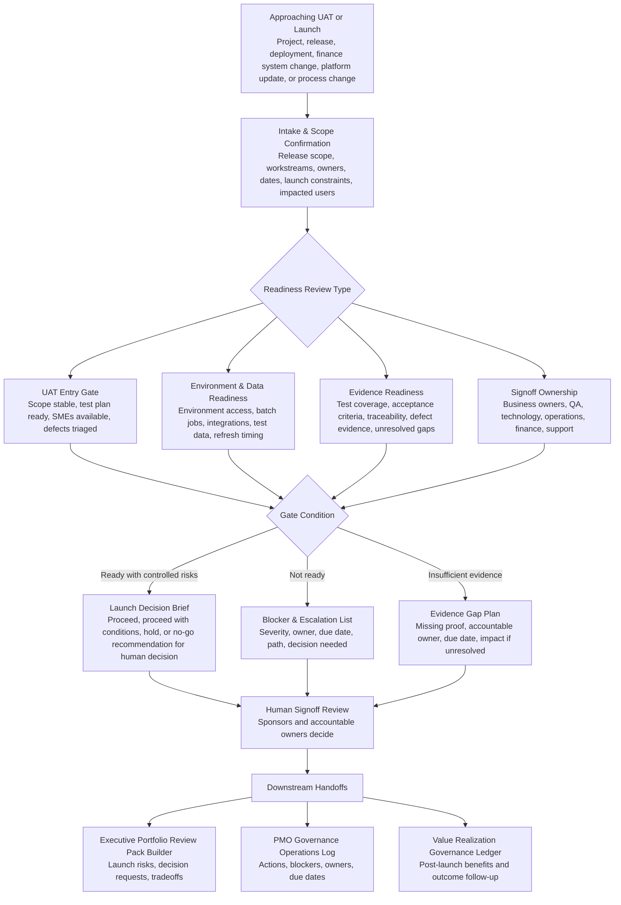

# Release Readiness and UAT Governance Pack

A human-governed ChatGPT Project package for assessing UAT readiness, launch evidence, blocker escalation, signoff ownership, and release decision support before business validation or production launch.

## Portfolio exhibit

| Review question | Where to look |
|---|---|
| Status | Public portfolio prototype for delivery-readiness, UAT, launch-gate, and signoff-governance review. |
| Best evaluator | PMO, program, release, QA, business validation, finance systems, revenue technology, operations, and sponsor-review leaders approaching UAT or launch. |
| Operating decision supported | Does the work have enough build/test evidence, environment readiness, data readiness, defect triage, blocker ownership, and signoff clarity for a human readiness decision? |
| Concrete example | [`examples/sample-output.html`](examples/sample-output.html) shows a synthetic readiness pack and launch decision brief. |
| Before / after proof | Before: test evidence, blockers, signoffs, defects, environment status, and launch constraints are scattered. After: the work has a readiness state, evidence gaps, blocker list, signoff view, and launch decision framing for human review. |
| Boundary | This pack supports readiness review. It does not execute tests, approve UAT, approve launch, accept defects, waive controls, or change environments. |
| Portfolio lane | [Prove delivery readiness](https://policani.net/#navigator). |

## Operating problem

Releases slip or create avoidable rework when business validation starts too late, UAT entry criteria are unclear, test evidence is weak, environments are unstable, data is not ready, unresolved defects are normalized, or signoff ownership is ambiguous.

This package gives PMO, program, release, QA, business, and technology leaders a lightweight readiness gate before UAT or launch. It helps turn scattered project notes into a reviewable readiness pack without pretending to run testing, approve release, accept defects, or replace accountable owners.

## Who it is for

- PMO and EPMO leaders
- Program and project managers
- Release managers
- QA and UAT coordinators
- Business process owners
- Finance systems and revenue technology leaders
- Platform, operations, and support readiness leads
- Sponsors preparing for launch go/no-go conversations

## What it does

This module helps a human leader:

- Capture release, UAT, environment, data, workstream, defect, and signoff inputs.
- Define UAT entry and exit criteria.
- Score readiness across scope, test coverage, evidence, data, environments, SMEs, defects, and signoff.
- Separate true blockers from normal delivery noise.
- Identify weak evidence, missing owners, late dependencies, unstable environments, and launch risk.
- Build a launch decision brief with proceed, proceed with conditions, hold, or no-go framing for human review.
- Route unresolved risks, decisions, actions, and value follow-up to adjacent portfolio modules.

## What it does not do

This pack supports readiness review for human owners. It does not operate as a QA execution system, test-management platform, release automation tool, deployment runbook, project approval workflow, or autonomous launch authority.

It does not:

- Execute tests.
- Approve UAT entry, UAT exit, or production launch.
- Accept defects or waive controls.
- Change environments, data, integrations, access, or release plans.
- Replace QA, release, business, finance, security, privacy, compliance, or executive owners.
- Certify financial, regulatory, accounting, operational, or customer-impact readiness.

## Module boundary

| Boundary element | Definition |
|---|---|
| Starts when | A project, release, deployment, finance system change, platform update, or business process change is approaching UAT, validation, pilot, cutover, or launch. |
| Ends when | The user has a readiness pack, gate assessment, blocker list, launch decision brief, and human-owned signoff view. |
| Produces | Entry/exit criteria, readiness scores, evidence gaps, environment/data readiness view, test coverage view, signoff matrix, blocker escalation list, and launch decision briefing. |
| Hands off to | Executive Portfolio Review Pack Builder, PMO Governance Operations Log, and Value Realization Governance Ledger. |
| Does not | Execute tests, approve release, accept defects, change environments, or replace QA/business owners. |

## Lifecycle position

| Portfolio lifecycle question | Owning module |
|---|---|
| What should exist? | AI Opportunity Intelligence Review System |
| Should the business rely on an existing artifact? | AI Artifact Lifecycle Governance System |
| Is formal investment justified? | Business Case System |
| What are we authorizing? | Project Charter Initiation Agent |
| What should be funded or sequenced? | Portfolio Prioritization Scoring Agent |
| Are we ready for UAT or launch? | **Release Readiness and UAT Governance Pack** |
| What needs executive review? | Executive Portfolio Review Pack Builder |
| How do actions, decisions, risks, and blockers stay visible? | PMO Governance Operations Log |
| Did the expected value materialize? | Value Realization Governance Ledger |

## Adjacent module fit

This package receives charter, scope, milestone, dependency, governance, and planning handoff information from the **Project Charter Initiation Agent**.

It sends:

- Launch risks, tradeoffs, decision requests, conditional launch concerns, and no-go rationale to **Executive Portfolio Review Pack Builder**.
- Blockers, actions, owners, due dates, escalations, unresolved decisions, and follow-through items to **PMO Governance Operations Log**.
- Post-launch value assumptions, baseline measures, benefit risks, and follow-up triggers to **Value Realization Governance Ledger**.

The non-overlap rule is simple: this module tests readiness to validate or launch. It does not create the business case, authorize the project, prioritize the portfolio, run the meeting log, or measure realized value after launch.

## Workflow



## How to use this in ChatGPT

Upload **only the files inside `chatgpt-project/`** when creating a ChatGPT Project.

Do not upload the full repository into ChatGPT. The other folders are for GitHub review, examples, workflow source, and package validation.

Recommended setup:

1. Create a new ChatGPT Project named `Release Readiness and UAT Governance Pack`.
2. Upload the contents of `chatgpt-project/` only.
3. Paste project notes, release scope, UAT plan excerpts, workstream updates, defect summaries, environment notes, data readiness notes, and signoff details.
4. Ask the project to begin with intake and produce a readiness pack.
5. Review all findings with accountable human owners before making release decisions.

Example starting prompt:

```text
Start a readiness review for this finance-impacting release. Use the intake file first. Identify missing information, score UAT readiness, separate blockers from manageable risks, and produce a launch decision brief for human signoff.
```

## Full-repository use for Codex or local work

Use the full repository when you want to inspect, revise, or extend the package.

Recommended local workflow:

1. Clone or unzip the repository.
2. Review `README.md`, `AGENTS.md`, and `architecture-decision.html`.
3. Inspect the runtime files in `chatgpt-project/`.
4. Review synthetic examples in `examples/`.
5. Review Mermaid source in `workflow/workflow.mmd`.
6. Review package validation in `quality-review/package-test-results.html`.
7. Modify runtime files only when the operating behavior needs to change.

No configuration file is required.

## Folder structure

```text
release-readiness-uat-governance-pack/
  README.md
  AGENTS.md
  LICENSE.md
  .gitignore
  architecture-decision.html
  chatgpt-project/
    start-here.md
    operating-model.md
    trigger-map.md
    release-readiness-intake.md
    uat-entry-exit-criteria.md
    evidence-readiness-screen.md
    environment-data-readiness-screen.md
    signoff-matrix-template.md
    blocker-escalation-rules.md
    launch-brief-template.md
    handoff-rules.md
    working-session-prompts.md
    quality-review-rubric.md
    privacy-human-control.md
  examples/
    sample-data.html
    sample-prompts.html
    sample-output.html
  workflow/
    workflow.mmd
  quality-review/
    package-test-results.html
```

## Runtime file count and constraints

- Runtime folder: `chatgpt-project/`
- Runtime structure: flat, no nested folders
- Runtime file count: 14
- Runtime cap: 25 files
- Required configuration: none
- External integrations: none
- Live-system authority: none

## Primary outputs

- UAT readiness intake summary
- Entry and exit criteria review
- Evidence readiness screen
- Environment and data readiness screen
- Readiness scorecard
- Signoff matrix
- Blocker and escalation list
- Evidence gap list
- Launch decision brief
- Downstream handoff notes

## Examples

Synthetic examples are included here:

- `examples/sample-data.html` - Dummy finance-impacting release scenario.
- `examples/sample-prompts.html` - Working prompts for ChatGPT usage.
- `examples/sample-output.html` - Example UAT readiness pack and launch brief.

The examples use fictional systems, teams, dates, defects, owners, and metrics. They are designed to demonstrate the workflow without exposing employer, client, security, financial, or proprietary data.

## Human-control statement

This package supports structured thinking, synthesis, evidence review, drafting, and decision support. It keeps approval, release, defect acceptance, risk acceptance, funding, compliance, finance, legal, security, privacy, HR, and executive decisions with accountable humans.

## Search keywords

PMO, EPMO, UAT readiness, release readiness, launch readiness, go no-go, production readiness, validation readiness, business validation, finance systems release, project governance, program governance, release governance, QA governance, test evidence, test coverage, readiness gate, entry criteria, exit criteria, defect escalation, blocker escalation, environment readiness, data readiness, signoff matrix, launch decision brief, executive decision support, AI-assisted PMO, ChatGPT Project, human-in-the-loop governance.
